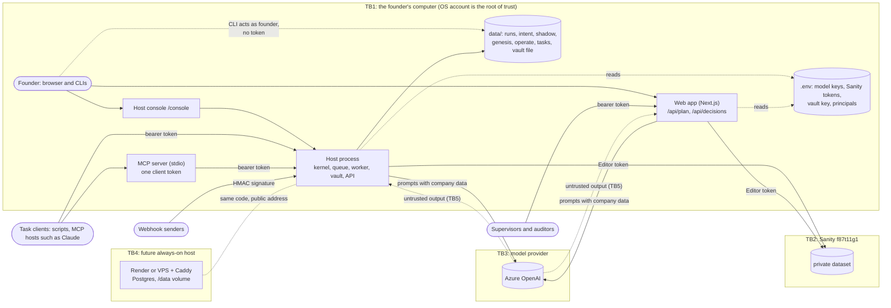

# Threat model

This is the security threat model for Nuera Quicksilver as the code stands on
2026-09-28 (verified implementation baseline 0.8.0, with M4 to M7 built;
operational evidence remains a separate release gate). Every mitigation below names the code that provides it and, where one
exists, the test that proves it. A claim without a test says so.

It is a working document, not a certification. Reread it at each milestone and
before any change in exposure (a public address, a second user, a customer).
The pass/fail list for the release gates is in [parity tests](parity-tests.md).

## Findings needing a fix

These are real defects, not hardening ideas. Each is small. F-1, F-2 and F-3
are **fixed** in commit `30b085e` on `work/security-fixes`; each row names the
tests that prove the fix.

| # | Severity | Where | What is wrong | Suggested fix |
|---|---|---|---|---|
| F-1 | Medium | `packages/kernel/src/triggers/webhook.ts`, lines 196–206 (`WebhookTrigger.receive`) | The signature covers `${timestamp}.${rawBody}` but not `X-Quicksilver-Delivery`. When a signature has already been seen and the request carries a delivery id, the code falls through to the idempotent enqueue, but the idempotency key is built from the **new** delivery id. Anyone who captures one signed delivery can replay it inside the ±5-minute window with a different delivery id and get a second run (or, for a task webhook, a second task). Checked with a scratch test outside the repo: the same signed body sent with delivery ids `evt_1` then `evt_attacker` returned 202 and 202, and the queue held 2 runs. The existing test `Webhook: a replayed signature without a delivery id is refused` only covers the no-header case. | Remember the delivery id with the signature in the replay cache (`remember(key, expiresAt, deliveryId)`), and return 409 when a seen signature arrives with a different delivery id. Or add a `v2` scheme that signs `${timestamp}.${deliveryId}.${rawBody}`. Add a test for the swapped-id replay, for both the run and the `deliver` (task) paths. **Fixed in `30b085e`:** the replay cache keeps the delivery id each signature was first seen with; a seen signature with a different delivery id, or with one added or dropped, is refused with 409 and nothing is enqueued or delivered. The exact resend (same signature, same delivery id) keeps its idempotent outcome. Senders must vary the body or timestamp per delivery (the same secret, second and body give the same signature). Tests: `triggers.test.ts` "ReplayCache: the first binding is kept and returned; a later one never overwrites it", "Webhook: a seen signature with a swapped delivery id is refused (F-1, run path)", "Webhook: a seen signature with a swapped delivery id never reaches the deliver sink (F-1, task path)". |
| F-2 | Medium (High once execution has real effects) | `apps/web/app/api/decisions/[id]/execute/route.ts`, line 142 (`POST`); also `observe/route.ts` line 33 and `resume/route.ts` line 40 | The execute route checks that a risky decision carries a bound supervisor approval, but it never authenticates the caller. RBAC defines `decision:execute` (held by `supervisor`), and nothing checks it. Anyone who can reach the web app can execute any approved decision at a time of their choosing, and can execute a decision that needs no approval (the process engine auto-approves low-risk ones) with no human involved at all. Execution is simulated today: it writes the decision's status, an `executionAudit` and a `metric` document. `observe` and `resume` also write with no caller check. | Call `verifySupervisorCredential(req, 'decision:execute')` before any read or write in `execute`, and record the principal as the executor in `executionAudit`. Require at least a valid principal (`decision:read` or `decision:propose`) for `observe` and `resume`. Add route tests for 401 and 403. **Fixed in `30b085e`:** `execute` runs the supervisor credential check with `decision:execute` (human only) before any read or write and records the principal as `executionAudit.executorId`; `observe` and `resume` require a principal with `decision:read` or `decision:propose`. The check is the pure helper `checkDecisionRouteCaller` in `apps/web/lib/nqc-approval.ts`. Tests (run by `seed:test`): `apps/web/lib/decision-route-auth.test.ts` "Decision routes: execute without a credential is 401 (F-2)", "Decision routes: execute with the wrong permission, a non-human or another tenant is 403 (F-2)", "Decision routes: execute by a human supervisor succeeds and names the executor (F-2)", "Decision routes: observe and resume need a principal with decision:read or decision:propose (F-2)", "Decision routes: without principals only the shared supervisor token is accepted; unconfigured fails closed". |
| F-3 | Low | `packages/host/src/intent-api.ts`, line 137 (`POST /api/intents/:id/answers`) | The answer is recorded with actor `{ id, kind: 'human' }` and provenance `HUMAN_SPECIFIED` whatever the principal's real kind. RBAC keeps `intent:provide` from agents but not from service principals, so a service principal configured with `intent-provider` would write values that the graph then treats as a human's own words, which only a human may change. The `dismiss` route next to it passes the real kind. | Refuse non-human principals with 403 (as the verdict, money and review routes do), or pass `principal.kind` and let `applyBeliefUpdate` refuse. Add a test with a service principal. **Fixed in `30b085e`:** non-human principals get 403 before anything is read or recorded. Test: `intent-api.test.ts` "a service principal cannot answer intent questions, even with intent-provider (F-3)". |

## 1. Scope and assumptions

**In scope**

- The single-tenant host (`packages/host`) as it runs today (M2): on the
  founder's computer, API on `127.0.0.1:8787` (local example config), file
  stores under `data/`, the secrets vault, the console at `/console`.
- Always-on hosting as documented for M5 ([always-on hosting](always-on-hosting.md)):
  Render or a VPS behind Caddy, Postgres run store, a public address for
  payment webhooks. Not deployed yet; treated as the next exposure.
- The web app (`apps/web`): the objective console, `/api/plan`, `/api/query`,
  the decision routes and the workflow routes.
- The task interface ([tasks](tasks.md)): HTTP API, the stdio MCP server,
  signed webhooks and the CLI.
- Sanity project `f87t11g1` (private `production` dataset). The legacy
  challenge project `d280bqjc` and its Context MCP endpoints are refused by
  the web app, the host stores and the agent package.
- Azure OpenAI models reached through `@quicksilver/agent`.
- The kernel, Aura, the playbooks (Onboard, Genesis, Operate) and their
  stores.

**Out of scope**

- The paused Sanity Challenge instance (synthetic, never connected to
  company data).
- The model provider's own security and the security of the founder's
  operating system, beyond the assumptions below.
- Physical attacks and legal process.

**Assumptions**

- One human operates the business today: the founder, configured as the
  sole operator where separation of duties allows it.
- The founder's OS account is trusted. Whoever can act as that account can
  read `.env`, the vault key and every file store, and can run the CLIs,
  which act as the founder without a token (see check 5 in section 4).
- Tokens are generated by the repository's tools (`npm run principal:token`,
  `npm run tasks -- client add`): 32 random bytes, stored only as SHA-256
  digests.
- Nothing moves money. The Genesis and Operate routes record money that has
  already moved; every response says `executed: false`.
- Tool steps are always blocked at run time on the host. The only agent that
  runs unattended is the read-only query agent.

## 2. Assets

| Asset | Where it lives | Why it matters |
|---|---|---|
| Money ledger (Genesis, Operate) | `data/genesis/<runId>/ledger.json`, `data/operate/<runId>/ledger.json`, or `moneyEntry` documents in Sanity | The 1.0.0 evidence requires every dollar to be traceable. Hash-chained (`packages/kernel/src/playbooks/economics.ts`, `appendMoney`, `verifyMoneyLedger`) |
| Payment-account secrets | Names only in `deploy/genesis/genesis-500.json` and `deploy/operate/operate-nuera.json` (`prerequisites.paymentAccounts`); values only in the vault | Card and payment access once Genesis starts |
| The secrets vault | One file (`vault.path`, for example `/data/vault.json`), AES-256-GCM; master key in `QUICKSILVER_VAULT_KEY` | Holds webhook signing secrets and, later, payment credentials |
| Intent ledger | `data/intent/ledger/<company>.intent-ledger.jsonl` or `intentLedgerEntry` documents | The founder's goals, weights, autonomy grants and hand-overs. Hash-chained; optional Ed25519 signatures (not enabled on the host) |
| Decision records and audit | Sanity `decision` documents (approval records, execution audits), `evaluationRecord` documents, run event logs, task audit trails | Accountability: who asked, who proposed, who approved, what ran |
| Policies and capabilities (the company model) | Sanity `policy`, `capability`, `entity` documents; `deploy/tasks/catalog.json` | They decide what the kernel allows |
| Shadow logs and the decision journal | `data/intent/onboard/<intentId>/shadow.json`, `learner.json`, `data/intent/decisions.jsonl`, `pending.json` | The founder's own judgments and reasons: personal business data, and the evidence for hand-over |
| Task client tokens | `data/tasks/clients.json` (digests only, mode 0600); the token itself sits in each client's config | A client token submits tasks and reads that client's results |
| Human principal tokens | `QUICKSILVER_PRINCIPALS` (digests only) | Approval, money recording, intent |
| Sanity tokens | `SANITY_AUTH_TOKEN` (Editor on the dataset), `SANITY_CONTEXT_TOKEN` (org-level Context Viewer), `SANITY_DEPLOY_TOKEN` (schema deploy) in `.env` | Editor can write every document, including approval records and policies |
| Model API keys | `AZURE_API_KEY` and related variables in `.env` | Cost; access to the provider account |
| IP boundary material | AMP patent material (never connected until PPA Rev 4.2 is filed); Forkling (frozen, read-only) | Premature disclosure of AMP harms the patent position; a write to Forkling breaks its freeze |

## 3. Actors and trust boundaries

| Actor | Trust | Identity | What it can do |
|---|---|---|---|
| Founder (human) | Trusted | Human principal in `QUICKSILVER_PRINCIPALS` (`intent-provider`, often also `supervisor`); the OS account for CLIs | States intent, approves, records money, judges shadow recommendations, hands over departments. Configured as sole operator where needed |
| Supervisors and auditors | Trusted for their role | Human principals with `supervisor` or `auditor` | Approve, execute, roll back, redrive (supervisor); read audit (auditor) |
| Task clients | Semi-trusted service | Service principal `client:<name>` with only `task-client` | Submit tasks, read and cancel their own |
| Trigger services | Semi-trusted service | Service principal with only `trigger` | Enqueue configured runs, submit tasks through a task webhook |
| Agents and LLMs | Untrusted output | Registered agent ids (`nuera-quicksilver:*`); agent principals never hold authority | Propose. Their output is data |
| Webhook senders | Untrusted until verified | Endpoint HMAC secret | One delivery per signed request |
| Sanity | Trusted storage, shared credential | Editor and Viewer tokens | Stores the company model, decisions, evaluation records, optional Aura and Genesis records |
| Model provider | Trusted processor of prompts | API key | Receives prompts, returns completions |
| Local machine and OS | Root of trust at M2 | The founder's account | Everything |
| Future hosting provider | Trusted operator of the box | Platform account | Holds the `/data` volume, environment secrets and the database |

Trust boundaries:

- **TB1** the OS account. Everything inside it is equally trusted today.
- **TB2** host and web app to Sanity. One Editor token per process: Sanity
  sees the server, not the human.
- **TB3** host and web app to the model provider. Company data leaves the
  machine in prompts.
- **TB4** always-on hosting. The same code with a public address.
- **TB5** model output back into the system. Model output never carries
  authority; the kernel re-derives every decision.
- The network edge of the host (bearer tokens, HMAC) and of the web app
  (a bearer token on every API route since A-3 was fixed in `6973cbe`, plus a
  same-origin JSON check on every state-changing request).

## 4. Answers to the specific checks

| # | Check | Answer | Evidence |
|---|---|---|---|
| 1 | Are all host API routes authenticated and RBAC-checked? | **Yes.** `dispatch()` authenticates every path under `/api` before any route runs, and returns 401 without a valid token. Each route then checks its permission: runs, dead letters, stats, schedules, webhooks and workflows with `this.authorize`; enqueue, cancel and redrive inside `WorkflowRunQueue` (its `access` option); secrets inside the vault; intents, shadow, decisions, Genesis and tasks in their handlers; `POST /api/intent-ledger/:company` inside Aura's `recordChange`. Unauthenticated by design: `/healthz`, `/readyz`, `/console` (a static page, no data), `/webhooks/:id` (HMAC), and `/metrics` only when `metricsPublic` is set. Since `6973cbe` the route table (`packages/host/src/routes.ts`) is matched first: an `/api` path it does not list is a 404 before any handler, and each route's permission floor is checked centrally (A-9). One route is worth knowing: `POST /api/genesis/experiments/:id/evaluate` needs only `decision:read`, yet it can apply a kill or close (stopping never needs permission, by design). | `packages/host/src/host.ts` lines 399–401 (`dispatch`), `authorize`, `require`; `host.test.ts` "health and readiness need no token; the management API does" |
| 2 | Routes without a test for auth failure | **None since `6973cbe` (A-9).** `host-routes.test.ts` walks the host's route table and asserts 401 without a token and with an unknown one, and 403 for a principal holding no permission, on every route except the pinned public list (`/healthz`, `/readyz`, `/`, `/console`, `POST /webhooks/:id`, which must refuse an unsigned delivery) and `GET /api/whoami` (any principal); it also checks a holder of the permission gets past the table. `app-routes.test.ts` finds every `apps/web/app/api/**/route.ts` on disk, imports it and calls each handler without Authorization (401), with an unknown token (401) and with a permissionless principal (403); only `GET /api/whoami` is reviewed to answer 200. A new route in either place is covered without editing the tests. | `packages/host/src/host-routes.test.ts` "route table (A-9): every route refuses a request without credentials (401) and a principal without its permission (403)", "route table (A-9): the public and any-principal routes are exactly the reviewed lists, each with a reason"; `apps/web/lib/app-routes.test.ts` "web API routes (A-3, A-9): every handler refuses no credential (401), an unknown token (401) and a principal without its permission (403)" |
| 3 | Is the web app's plan/execute/approval path authenticated, and as whom does it run? | **Yes, since `6973cbe` (A-3).** `POST /api/plan` requires a principal with `decision:propose` before it reads the body (`guardWebRoute` in `apps/web/lib/route-guard.ts`), records that principal as `requestedBy` (never a body field), and is rate-limited per principal. It calls the planner and reviewer models and writes decision documents. When the same person later approves, separation of duties refuses unless they are the configured sole operator and give a written justification; the 403 says whether the override is open and the console then asks for the justification. With `QUICKSILVER_PROCESS_ENGINE=on`, low-risk decisions are auto-approved by the kernel with no human. Approve, reject, request-evidence and rollback require `verifySupervisorCredential` (a per-person hashed token with `decision:approve` or `decision:rollback`, human, in `QUICKSILVER_TENANT_ID`; or the interim shared `NQC_SUPERVISOR_TOKEN`). Execute requires `decision:execute` (human) and records the executor; observe and resume require a principal with `decision:read` or `decision:propose` (F-2, fixed in `30b085e`). The home page sends the token a person pastes into its sign-in box (kept in the tab's `sessionStorage`, sent only to the exact same-origin API paths in `mayCarryConsoleToken`: the decision routes, `/api/whoami`, `/api/plan`, `/api/query`, `/api/workflows/*`); without it they get 401 and show "Sign in to do this". The approver recorded is always the authenticated principal; the approve body is strict and refuses any approver field. Sanity writes run as the server's `SANITY_WRITE_TOKEN` (Editor) and the read-only decision log as `SANITY_READ_TOKEN` (Viewer), each falling back to the combined `SANITY_AUTH_TOKEN` until the founder sets them (A-7); the human is recorded only in fields (`requestedBy`, `approvedBy`, `approvalRecord.supervisorId`). | `apps/web/lib/nqc-approval.ts` (`identifyRequester`, `verifySupervisorCredential`); `apps/web/app/api/plan/route.ts`; `apps/web/app/api/decisions/[id]/*/route.ts` |
| 4 | Are approvals bound to decision content (hashes) everywhere approvals exist? | **Supervisor approval (web):** yes, partly. The approval stores `decisionActionFingerprint` over decision id, `selectedAction`, policy snapshot digest, risk and `requiredApproval`; execute recomputes it and the live policy snapshot, and checks the approver is still a human allowed by the current policies. Gaps: the server computes the fingerprint when the supervisor clicks, and the client never sends the fingerprint it displayed, so a change between viewing and approving is approved silently; the fingerprint leaves out evidence ids, actor, capability and financial exposure; no test. **Tasks:** yes. `requestHash` and `decisionHash` are stored with the approval and recomputed before enqueue; request fields are immutable in the store. Same caveat that the approver does not echo the hash. **Genesis and Operate money:** the founder's `confirm: true` is part of the same request, and the spend decision is recomputed under the per-run lock, so what is confirmed is what is recorded. But the ledger entry does not record the decision or the confirmation (only the response does). **Genesis `decide`:** not bound: it applies the verdict current at that moment, which can differ from the one the founder saw if a measurement arrived in between. **Experiment start and playbook publishing:** bound by pinned digests. **WAES and manual reviews:** bound to the content digest. **Operate plan approval:** the approved plan's amounts are stored in the record. | `apps/web/lib/nqc-approval.ts` `decisionActionFingerprint`; `execute/route.ts`; `packages/host/src/tasks.ts` `approve`, `runApproved`, `requestHash`, `decisionHash` (test: "a request or decision changed after approval is refused, not run"); `genesis-api.ts` money and `decide`; `playbook.test.ts` "publishing needs a human supervisor who is not the author, and pins the digest"; `genesis-reviews.test.ts` "a manual review is bound to the exact text, marked manual, and made only by a human" |
| 5 | Are append-only stores really append-only against a local attacker? | **No, and they cannot be at M2.** They are files on the founder's disk (mode 0600) or Sanity documents written with the Editor token. Append-only is enforced by the code that writes them (`checkAppendOnly` for tasks, `createIfNotExists` and revision checks for Sanity, chain verification on load), not by the OS or a third party. Anyone who can act as the founder's user can rewrite or delete them. The money and intent ledgers are hash chains **without a key**, so someone who can run the code can recompute a consistent chain after an edit; removing the newest entries leaves a valid chain; the intent ledger supports Ed25519 signatures, but the host never passes a signing key. Shadow logs, the decision journal, task files and review files have no chain at all. The vault is encrypted with AES-256-GCM and authenticated associated data, but its key sits in the same `.env` on the same disk. The CLIs act as the founder with no token: "whoever holds these files runs the business" ([tasks](tasks.md#5-cli)). What this means: the stores are tamper-**evident** against accidents and naive edits, and they make every change attributable in normal use. They are not tamper-**proof** against the founder's own account or malware running as it. | `packages/host/src/tasks.ts` `checkAppendOnly`; `packages/aura/src/store.ts` `loadLedger`; `packages/kernel/src/playbooks/economics.ts` `verifyMoneyLedger`; `packages/aura/src/ledger.ts` `signingKey` (unused by `packages/host/src/main.ts`) |
| 6 | Are secrets ever logged? | **Not by the host's own code paths that were found.** The host logger redacts values under sensitive keys, credential-shaped strings (`qs_…`, `whsec_…`, `sk-…`, `Bearer …`) and every webhook secret it resolved from the vault or environment. Gaps: model keys (Azure keys are not `sk-` shaped) and the Sanity tokens are never registered with `redactValue`, and Sanity tokens do not match the `sk-` pattern, so they are redacted only when they appear under a sensitive key. The host logs provider and store error messages (`request failed`, `evaluation audit write failed`); those do not normally contain keys, but nothing guarantees it. The web app logs whole error objects with `console.error` and returns `err.message` to the caller from `/api/plan` and `/api/query`, with no redaction. Intended one-time prints: `npm run tasks -- client add` (the new token), `npm run host -- vault keygen` (a new master key), `npm run principal:token` (a new token). The grep of logging calls found no other call that prints a token, key or secret field. | `packages/host/src/log.ts` (`redact`, `redactValue`, `CREDENTIAL_VALUE`); `observability.test.ts` "secrets are redacted by key, by credential shape, and by registered value"; `host.ts` `resolveSecret` |
| 7 | Rate limits beyond tasks? | **Yes, since `6973cbe` (A-5).** One token bucket (`TokenBucketLimiter`, now in `@quicksilver/kernel/rate-limit`) serves every limit. Host, per principal, by the class in the route table: `write` (burst 60, 120 a minute) on every state-changing route, `model` (burst 10, 20 a minute) on `POST /api/intents`, `POST /api/shadow/:id/generate`, `POST /api/runs` and redrive; per endpoint on `POST /webhooks/:id` (burst 60, 120 a minute, counted before the signature check; `webhooks[].rateLimit` overrides); task submission keeps its own bucket (burst 10, 30 a minute). All configurable in `http.rateLimits`. Web, per principal: `QUICKSILVER_WEB_RATE_LIMIT_MODEL` (default 5/10) on plan, query and live workflow runs, `QUICKSILVER_WEB_RATE_LIMIT_WRITE` (default 30/60) on the decision routes. A refusal is 429 with `Retry-After`; a 401 or 403 spends nothing. **Limits:** buckets are in memory, per host process and, on Vercel, per serverless instance (reset on a cold start), so the web limit is not global; no datastore was added. The queue's backpressure (1,000 queued, 100 per tenant) still applies. | `packages/kernel/src/rate-limit.ts`; `packages/host/src/routes.ts`; `apps/web/lib/route-guard.ts`; `rate-limit.test.ts` "Rate limit (A-5): a bucket per key allows the burst, then refuses with a whole-second Retry-After, then refills"; `host-routes.test.ts` "rate limits (A-5): write routes are limited per principal with 429 and Retry-After; reads are not", "rate limits (A-5): webhook deliveries are limited per endpoint, before the signature is checked"; `app-routes.test.ts` "web rate limits (A-5): the route handlers apply them (plan: model; decision action: write)"; `tasks.test.ts` "rate limit: a per-client token bucket, with consistent JSON errors" |
| 8 | Webhook signature verification and replay protection | HMAC-SHA256 over `${timestamp}.${rawBody}`, constant-time comparison, ±300 s tolerance, one generic 401 message, at most 5 signatures per header, secrets of 32+ characters, size and content-type checked first, rotation with several secrets. Replay: an in-memory cache refuses a repeated signature without a delivery id (409); with a delivery id, a retry maps to the same run, and a seen signature under a different delivery id is refused (409). **F-1 fixed in `30b085e`.** The replay cache is per process (documented; one host per tenant is the supported shape). A missing webhook secret stops startup. | `packages/kernel/src/triggers/webhook.ts`; `triggers.test.ts` webhook tests; `host.test.ts` "a webhook whose vault secret is missing stops startup (fail closed)" |
| 9 | CSRF and CORS on the host HTTP server | **Host: sound for its model.** No CORS headers are sent, so browsers block cross-origin reads. Authentication is a bearer header only (no cookies), so a cross-site request carries no credential. `readJson` requires `Content-Type: application/json`, so a cross-site form or `text/plain` post gets 415. The console sends `frame-ancestors 'none'`, `connect-src 'self'`, `form-action 'none'` and renders data with `textContent` only. The `Host` header is not checked, so DNS rebinding can reach the unauthenticated routes (health, readiness, the static console), nothing more. **Web app: sound since `6973cbe` (A-3).** Every API route needs an `Authorization: Bearer` header, which the console keeps in `sessionStorage` and adds itself (no cookie), so a cross-site request carries no credential. On top of that, `proxy.ts` refuses every non-GET `/api/*` request that is not `application/json` (415) or whose `Origin` or `Sec-Fetch-Site` shows another site (403), before any route runs (`lib/request-guard.ts`; extra origins only through `QUICKSILVER_WEB_ALLOWED_ORIGINS`). The app sends no CORS headers. Requests with neither header (scripts, curl) pass the check and still need a token. | `packages/host/src/host.ts` `readJson`, `CONSOLE_HEADERS`; `shadow-api.test.ts` "the console page is served without data, with a strict content policy"; `apps/web/lib/request-guard.ts`, `apps/web/proxy.ts`; `app-routes.test.ts` "cross-site check (A-3, T-30): state-changing API requests must be JSON and same-origin", "cross-site check (A-3): the proxy refuses before any route handler, with the security headers" |
| 10 | Request size limits | **Host:** `readBody` enforces the declared length and the streamed length. Defaults: `http.maxBodyBytes` 256 KiB (configurable 1 KiB–4 MiB); task routes, cancel and redrive 16 KiB; `PUT /api/secrets/:name` 80 KB; webhooks the larger of `maxBodyBytes` and 256 KiB, then the endpoint's own limit. `requestTimeout` 30 s, `headersTimeout` 15 s. Run input at most 256 KiB; task objective 2,000 characters, inputs 8 KB and depth 6. **Web:** the workflow routes cap at 256 KiB but read the whole body before counting when no `Content-Length` is sent; `/api/plan` validates the objective (3–2,000 characters) only after `req.json()` has read an unbounded body; `/api/query` has no length limit on `question`; the approval `comment` has no maximum. | `host.ts` `readBody`, `readJson`; `config.ts` (`maxBodyBytes`); `packages/host/src/tasks.ts` `TASK_LIMITS`; `tasks.test.ts` "validation: size and fields"; `apps/web/app/api/query/route.ts` line 23 |
| 11 | Path traversal in ids used for file paths | **None found.** Every id that becomes part of a path is checked against a pattern before `join`: intent graph ids (`GRAPH_ID`, `packages/aura/src/store.ts`), company ids (`COMPANY_ID`), shadow intent ids (`ID`, `shadow-api.ts`), task ids (`TASK_ID`, `tasks.ts`), the Genesis run id (`RUN_ID`, from config). Vault names are keys inside one file. Run ids, experiment ids and recommendation ids are looked up, not joined into paths. GROQ queries are parameterized. The CLIs read any file path the founder passes (`onboard connect`, `genesis review`); that is a trusted input. | Patterns cited; `model-document.test.ts` "Queries are parameterized and project the M7 fields"; `store.test.ts` "Sanity ids keep intent out of public reads and reject unsafe company ids" |
| 12 | Sanity token scope | **Split in code since `6973cbe` (A-7).** Every Sanity client is created in one helper per app or package (`apps/web/lib/sanity-client.ts`, `packages/host/src/sanity-client.ts`, `apps/studio/lib/sanity-client.ts`), which asks for read or write: read paths (the web decision log, `npm run smoke`, the dataset export) use `SANITY_READ_TOKEN` (Viewer), write paths (plan, decision routes, evaluation records, host stores, seed and reset scripts, `e2e:live`) use `SANITY_WRITE_TOKEN` (Editor). Until the founder creates them, each falls back to the combined `SANITY_AUTH_TOKEN` (Editor: read and write on every document in the private dataset) with a one-time warning; a read never borrows the write token or the reverse. A test fails if any other file creates a client or reads these variables. `SANITY_CONTEXT_TOKEN` is the org-level Context Viewer token used by the agents' MCP calls (read). Schema deploy uses a separate `SANITY_DEPLOY_TOKEN` or the founder's own login. The legacy project is refused in the web app (`getDedicatedSanityProjectId`), the host stores (`LEGACY_CHALLENGE_PROJECT_ID`) and the agent package (legacy endpoint names and knowledge base id). Consequences: whoever holds the Editor token can write `approvalRecord`, `approvedBy`, policies and capabilities directly, bypassing every route; "read-only in Studio" schemas are a Studio UI setting, not access control; the query agent can read any document in the dataset and surface it to whoever runs a query workflow. | `packages/kernel/src/sanity-tokens.ts`; `rate-limit.test.ts` "Sanity tokens (A-7): reads use SANITY_READ_TOKEN and writes SANITY_WRITE_TOKEN; neither falls back to the other"; `sanity-tokens.test.ts` "Sanity clients (A-7): only the per-app helpers create clients or read SANITY_*_TOKEN"; `sanity-stores.test.ts` "Sanity tokens (A-7): host stores and the evaluation sink write with SANITY_WRITE_TOKEN; a read asks for SANITY_READ_TOKEN"; [sanity-isolation.md](sanity-isolation.md); `apps/web/lib/sanity-config.ts`; `packages/host/src/sanity-client.ts`; `packages/agent/src/mcp.ts`; `sanity-stores.test.ts` "the legacy challenge project is refused by every Sanity store and by the env config"; `contracts.test.ts` "the paused challenge project's Context MCP endpoints and knowledge base are refused" |
| 13 | Model output schema validation | Every model call asks for structured output against a zod schema (planner, reviewer, query agent, shadow agent, intent parser), with strict schemas (`schemas.test.ts` "Strict output: … lists every property as required"). `executeGovernedAgent` checks the result shape and runs the NQC evaluation on every agent result. The kernel then resolves actor, capability, policies and evidence from Sanity itself; an action whose actor or capability does not resolve gets no decision. Shadow proposals are validated again (`validateProposal`) and citations that are not in the intent graph are dropped. The model intent parser keeps only values whose quote appears in the objective and can never grant autonomy. **Not validated against anything but the schema:** the planner's own risk inputs (`operationalImpact`, `uncertainty`, `reversible`, `financialExposure`), which feed the kernel's risk calculation (T-40). | `packages/agent/src/contracts.ts` `executeGovernedAgent`; `contracts.test.ts` "a governed run with a stub worker returns an NQC evaluation"; `shadow-agent.test.ts` "proposals keep only citations that exist in the graph; uncited proposals are dropped"; `aura.test.ts` "production parser: the model's parse, except it can never grant acting alone" |
| 14 | What happens if the model returns something invalid? | It fails closed everywhere found. Planner: `generateText` throws, `/api/plan` returns 500 and persists nothing (it does return the error message). Reviewer: falls back to "unreviewed"; it is advisory only. Query agent in a workflow: the step fails; a missing or malformed evaluation fails the run. Host agent steps with no provider configured fail closed. Shadow generate: a thrown error is a 502; invalid proposals are refused with reasons and valid ones are still judged by the kernel. Intent parser (model mode): no structured output throws, and the intent is not created. | `workflows.test.ts` "Runtime: missing or malformed evaluator output fails closed"; `host.test.ts` "agent steps fail closed when no model provider is configured"; `shadow-api.test.ts` "the shadow-stage agent proposes; departments it was not asked about are refused" |

## 5. Threats by component (STRIDE)

Residual risk is judged for today's exposure (the founder's computer) unless
the row says otherwise. "Gap" names the action from section 8.

### 5.1 Host HTTP API and console

| ID | STRIDE | Threat | Where | Existing mitigation (code; test) | Residual | Gap / action |
|---|---|---|---|---|---|---|
| T-01 | S | A stolen or guessed bearer token | `host.ts` `authenticate` | 32-byte random tokens, SHA-256 digests only, constant-time comparison over every entry, shared and duplicate tokens refused (`packages/kernel/src/identity/tokens.ts` `StaticTokenIdentityProvider`; `identity.test.ts` "Tokens: only digests are stored; authentication is exact and returns a copy", "Tokens: disabled principals, shared tokens, duplicates, and bad digests are refused"). The console keeps the token in `sessionStorage` for one tab | Low | Tokens never expire and have no rotation schedule; SSO/OIDC is planned before 0.9.0 (B-1) |
| T-02 | E | A principal from another tenant acts on this host | `host.ts` constructor | Refused at startup (`host.test.ts` "the host serves exactly one tenant"); RBAC tenant isolation (`identity.test.ts` "RBAC: tenants are hard boundaries, even for supervisors and admins") | Low | Multi-tenant tests before 0.9.0 (B-14) |
| T-03 | E | A new route forgets its permission check | `host.ts` `dispatch`, `routes.ts` | Central authentication gate for `/api`; the route table is matched first (unlisted `/api` paths are 404) and each route's permission floor is checked before its handler; per-route `authorize` in handlers; table-driven 401/403 test over every route (`host-routes.test.ts`, both A-9 tests) | Low | **A-9 fixed in `6973cbe`** |
| T-04 | E, T | An operator enqueues an arbitrary or effectful graph | `POST /api/runs` | Only configured workflows; `checkWorkflow` enforces the execution policy; tool steps blocked at run time (`config.test.ts` "checkWorkflow accepts query agents by short or full id and caps agent steps"; `host.test.ts` "tool steps are blocked on the host and never dispatched") | Low | — |
| T-05 | D | Flooding, large bodies, slow clients | All routes | Body limits, `requestTimeout` and `headersTimeout`, queue backpressure, bounded metric labels (`observability.test.ts` "the standard host metric set registers once per registry"); per-principal `write` and `model` token buckets on every state-changing and model-calling route (`host-routes.test.ts` "rate limits (A-5): write routes are limited per principal with 429 and Retry-After; reads are not") | Low; Medium when public | **A-5 fixed in `6973cbe`**. In memory, per process; a caller with many principals gets many buckets |
| T-06 | I | Metrics reveal workflow names and volumes | `GET /metrics` | `audit:read` unless `metricsPublic` (`host.test.ts` "metrics need audit:read unless configured public") | Low | Keep `metricsPublic` off when hosted |
| T-07 | I | Error details leak internals | `host.ts` `handle` | Uncaught errors return `{ error: 'Internal error.' }`; details go to the log | Low | — |
| T-08 | S, E | The host listens on every interface | `config.ts` line 156 | The local example sets `127.0.0.1`; Compose publishes on `127.0.0.1` only. A config without `http.host` binds `127.0.0.1`; `0.0.0.0` must be set explicitly (`config.test.ts` "the host binds to loopback by default; a public bind must be explicit (A-4)") | Low | **A-4 fixed in `30b085e`** |
| T-09 | T, I | Script injection in the console steals the token | `packages/host/src/console.html` | CSP with `connect-src 'self'`, `frame-ancestors 'none'`; all data rendered with `textContent` (no `innerHTML`) (`shadow-api.test.ts` "the console page is served without data, with a strict content policy") | Low | CSP still allows inline script; move to a nonce if the page grows |
| T-10 | R | An action cannot be attributed later | Access decisions | Every access decision reaches the audit sink; the host logs denials; run events record actors (`identity.test.ts` "RBAC: every decision reaches the audit sink, and a failing sink changes nothing") | Medium | The access audit is only stdout logs; durable access-audit store (B-2) |

### 5.2 Webhooks and triggers

| ID | STRIDE | Threat | Where | Existing mitigation (code; test) | Residual | Gap / action |
|---|---|---|---|---|---|---|
| T-11 | S | A forged delivery | `webhook.ts` `receive` | HMAC-SHA256, constant time, timestamp window, generic 401 (`triggers.test.ts` "Webhook: bad signatures, wrong secrets, stale or future timestamps are rejected with one generic error") | Low | — |
| T-12 | T, R | A captured delivery is replayed | `webhook.ts` lines 196–206 | Replay cache for repeated signatures without a delivery id, and for a seen signature under a different delivery id (`triggers.test.ts` "Webhook: a replayed signature without a delivery id is refused", "Webhook: a seen signature with a swapped delivery id is refused (F-1, run path)", "Webhook: a seen signature with a swapped delivery id never reaches the deliver sink (F-1, task path)") | Low | **F-1 fixed in `30b085e`** (A-1) |
| T-13 | D | Delivery floods | `/webhooks/:id` | Size limit before verification, cheap 404/401, queue backpressure as 429 (`triggers.test.ts` "Webhook: RBAC and backpressure surface as 403 and 429"); a per-endpoint token bucket before the signature check (`host-routes.test.ts` "rate limits (A-5): webhook deliveries are limited per endpoint, before the signature is checked") | Low to Medium when public | **Per-endpoint limit fixed in `6973cbe` (A-5).** Forged floods can spend a real sender's budget (senders retry on 429); add a per-source-address limit at the proxy when an endpoint is public |
| T-14 | E | The payload picks the capability or department | Task webhooks | The host config fixes both (`tasks.test.ts` "webhooks: a signed delivery becomes a task through the same intake; the payload cannot pick the capability") | Low | — |
| T-15 | E | A trigger identity holds more than `trigger` | `config.ts` | Startup refuses it (`config.test.ts` "trigger identities must hold only the trigger role") | Low | — |
| T-16 | I | A webhook secret is written into the config | `config.ts` `SECRET_REF` | Only `vault:` and `env:` references (`config.test.ts` "secrets can only be references, never inline values") | Low | Use `vault:` only for public endpoints (A-6) |
| T-17 | D, S | The host serves an endpoint it cannot verify | `host.ts` `start` | A missing secret stops startup (`host.test.ts` "a webhook whose vault secret is missing stops startup (fail closed)") | Low | — |
| T-18 | T | A cron slot runs twice | `cron.ts` | Idempotency key per slot (`triggers.test.ts` "Scheduler: replicas and restarts never duplicate a slot (idempotency key per slot)") | Low | — |

### 5.3 Task interface (API, MCP, webhook, CLI)

| ID | STRIDE | Threat | Where | Existing mitigation (code; test) | Residual | Gap / action |
|---|---|---|---|---|---|---|
| T-19 | S | A client token leaks from the client's config | `task-clients.ts` | Digest-only storage, one token per client, revocation takes effect on the next request (`tasks.test.ts` "client tokens are stored hashed and shown once (registry and CLI)") | Medium | The token sits in plain text in the MCP host's config file; add expiry and rotation (B-1) |
| T-20 | E | A client (or the model behind it) approves its own task | `tasks.ts` `approve`, `assertDecider` | `task-client` has no `task:approve`; the approver must be human and not the submitter (`tasks.test.ts` "a task client cannot approve, deny, or read another client's tasks; humans approve and the submitter never counts"; `identity.test.ts` "RBAC: task clients may only submit tasks and read their own; the founder decides tasks; agents never do"; `mcp-tasks.test.ts` "the tools: five, none approves, and each says the kernel decides and a human approves in the console") | Low | — |
| T-21 | E | Instructions in the objective or inputs change permissions or status | `tasks.ts` `intake` | Risk inputs come from the catalog; text is data (`tasks.test.ts` "injection text in the objective or inputs changes neither permissions nor status") | Low for authority | Downstream model effects: L-01 |
| T-22 | D | Task floods, or slow reads as the store grows | `tasks.ts` `submit`, `list` | Token bucket per principal (`tasks.test.ts` "rate limit: a per-client token bucket, with consistent JSON errors") | Medium over time | Every idempotent submit and every list reads all task files; add an index (B-12) |
| T-23 | I | A client reads another client's task, or company data through results | `tasks.ts` `get`, `list` | Another client's task is a 404 (`mcp-tasks.test.ts` "MCP carries the client's own authority only: bad tokens fail, other clients' tasks stay hidden") | Medium | A `reports.brief` task returns what the query agent reads from Sanity; the catalog is the only scope control. Classify which capabilities a client may use (B-15) |
| T-24 | T | A task is edited after approval | `tasks.ts` `checkAppendOnly`, `runApproved` | Immutable request fields, append-only audit, hash re-check before the run (`tasks.test.ts` "the file store is append-only, atomic and private", "a request or decision changed after approval is refused, not run") | Low in code; see check 5 for a local attacker | — |
| T-25 | I, E | AMP material enters, or Forkling is changed | `task-boundaries.ts` `checkTaskBoundaries` | Pattern boundaries before the kernel (`tasks.test.ts` "boundaries: AMP patent material and writes to frozen Forkling are refused before the kernel") | Low to Medium | The boundary matches words, so a disguised reference passes it. AMP material is not connected anywhere, which is the real control. Keep it that way until PPA Rev 4.2 is filed |
| T-26 | S, I | The MCP server sends the token over plain HTTP | `mcp-tasks.ts` `checkHostUrl` | https required unless loopback (`mcp-tasks.test.ts` "the stdio server: a real process, token from the environment, stdout only MCP", which asserts `checkHostUrl`) | Low | — |
| T-27 | R | The channel label is spoofed | `host.ts` (`X-Quicksilver-Task-Source`) | The header can only say `api` or `mcp`, and it grants nothing | Low | Do not use `source` as audit evidence of the caller; the principal is |

### 5.4 Web app (`apps/web`)

| ID | STRIDE | Threat | Where | Existing mitigation (code; test) | Residual | Gap / action |
|---|---|---|---|---|---|---|
| T-28 | S, E, D | Anyone who can reach the app creates decisions and spends model money | `/api/plan`, `/api/query`, `/api/workflows/*` | Every API route requires a principal before it reads the body: plan `decision:propose`, query `decision:read`, validate and simulate `workflow:read`, live runs `run:enqueue` (and still off unless `QUICKSILVER_WORKFLOW_LIVE_RUNS=on`); per-principal model limits (`app-routes.test.ts` "web API routes (A-3, A-9): every handler refuses no credential (401), an unknown token (401) and a principal without its permission (403)", "web route permissions (A-3): plan needs decision:propose, query decision:read, workflows workflow:read or run:enqueue", "web rate limits (A-5): the route handlers apply them (plan: model; decision action: write)") | Low | **A-3 and A-5 fixed in `6973cbe`.** Web limits are per serverless instance, not global. `next dev` now binds to `127.0.0.1` locally; this does not change Sanity configuration or hosted binds |
| T-29 | E | Unauthenticated execute, observe, resume | `decisions/[id]/*/route.ts` | Risky decisions need a bound supervisor approval before execute; execute requires `decision:execute` (human) and records the executor; observe and resume require `decision:read` or `decision:propose` (`decision-route-auth.test.ts`, all). The console buttons send the signed-in person's token and show "Sign in to do this" on 401 and the missing permission on 403, with no automatic retry (`console-auth.test.ts` "console messages: 401 asks to sign in, 403 names the permission, anything else is left to the caller") | Low | **F-2 fixed in `30b085e`** (A-2) |
| T-30 | T | Cross-site request forgery against the web API | All `POST` routes | Bearer tokens only (no cookies); the proxy refuses non-JSON bodies (415) and a foreign `Origin` or `Sec-Fetch-Site` (403) on every state-changing `/api` request (`app-routes.test.ts` "cross-site check (A-3, T-30): state-changing API requests must be JSON and same-origin", "cross-site check (A-3): the proxy refuses before any route handler, with the security headers") | Low | **A-3 fixed in `6973cbe`** |
| T-31 | S, E | Supervisor approval with a weak credential | `nqc-approval.ts` `verifySupervisorCredential` | Per-person hashed tokens with RBAC and tenant; human only; separation of duties (`separation.test.ts` all); the policy snapshot must be current | Medium | The interim shared `NQC_SUPERVISOR_TOKEN` still works when `QUICKSILVER_PRINCIPALS` is unset, and since `6973cbe` it may also plan (`decision:propose`) and use the workflow builder (`workflow:read`); route tests exist (A-9); remove the fallback with SSO (B-1) |
| T-32 | D | Unbounded bodies and fields | `/api/query` `question`, approval `comment`, `/api/plan` body | Objective length checked after parsing | Medium | Byte caps before parsing and field maximums (B-11) |
| T-33 | I | Internal error messages returned to callers | `plan/route.ts`, `query/route.ts` (`detail: err.message`) | — | Low | Return a generic message; log the detail with redaction (B-8) |
| T-34 | E | Fault injection or live workflow runs left on in a shared deployment | `execute/route.ts` (`QUICKSILVER_ALLOW_FAULT_INJECTION`), `workflows/run/route.ts` | Both off by default; injected outcomes are stamped `faultInjection`; with `NODE_ENV=production` the host (`main.ts`) and the web app (`instrumentation.ts`) refuse to start with either flag on, and both routes treat the flags as off (`config.test.ts` "development-only switches stop the host in production (A-10)", "the host process refuses to start with a development-only switch on in production (A-10)") | Low | **A-10 fixed in `30b085e`** |
| T-67 | I, S | A script in the web console reads the signed-in person's token | `apps/web/app/page.tsx` (`ConsoleSignIn`), `apps/web/lib/console-auth.ts` | The token is kept only in the tab's `sessionStorage` and page memory (cleared when the tab closes; never `localStorage` or a cookie), sent only to `/api/decisions/<id>/<route>` and `/api/whoami` (`console-auth.test.ts` "console token: sent only as a bearer header to this app's decision routes and whoami", "console token: saved, read and cleared under one sessionStorage key; storage failures never throw"); `GET /api/whoami` returns no token or digest (`console-auth.test.ts` "whoami: a supervisor gets 200 with id, kind, tenant and permissions, and no secrets"); the page renders data through React (no `dangerouslySetInnerHTML`); a sign-out button clears it. `apps/web/proxy.ts` sends a per-request nonce Content-Security-Policy on every page and API response (`lib/security-headers.ts`): `script-src 'nonce-…' 'strict-dynamic'` (no host, no wildcard, no `'unsafe-inline'`, no `'unsafe-eval'` outside `next dev`), `connect-src 'self'` (Sanity and the model are called only server-side), `frame-ancestors 'none'`, `object-src 'none'`, `base-uri 'none'`, `form-action 'self'`, plus `X-Content-Type-Options: nosniff`, `Referrer-Policy: no-referrer`, `X-Frame-Options: DENY`; the root layout renders per request so Next.js stamps the nonce on its scripts (`security-headers.test.ts` "CSP (T-67): no unsafe-eval, no wildcard or third-party script source, nonce plus strict-dynamic only", "CSP (T-67): same-origin connections only, no framing, no plugins, companions set", "CSP (T-67): unsafe-eval appears only for next dev, and the proxy enables it only when NODE_ENV is development") | Low | **Fixed** (CSP). `style-src` allows `'unsafe-inline'` because Next.js/React emit inline styles without a nonce (styles cannot run script). Tokens never expire (B-1) |
| T-68 | I | The decision log page shows decisions to anyone who can reach the app | `apps/web/app/decisions/page.tsx` | Server-rendered with the read-only `SANITY_READ_TOKEN` (Viewer), so the page cannot write; it holds no token for the browser | Low locally; Medium if deployed publicly | Pages have no session to check (the console token lives in `sessionStorage`, which a server render cannot see). Put the page behind sign-in with SSO sessions (B-1), or behind the platform's password protection until then |

### 5.5 Kernel and approvals

| ID | STRIDE | Threat | Where | Existing mitigation (code; test) | Residual | Gap / action |
|---|---|---|---|---|---|---|
| T-35 | E | An agent approves, executes or reads secrets | `identity/rbac.ts` `AUTHORITY_PERMISSIONS` | Agents never hold authority (`identity.test.ts` "RBAC: agents never gain authority, even if a role would grant it"; `nqc.test.ts` "AgentRegistry: agents can never hold approval authority"; `process.test.ts` "Lifecycle: approving needs a human; an agent is refused with a reason") | Low | — |
| T-36 | T | The action changes between approval and execution | Web fingerprint, task hashes, digests | See check 4 | Medium | The approver echoes the hash they saw; widen the web fingerprint; bind Genesis `decide` (B-3) |
| T-37 | E | A policy is loosened by priority, scope or supersession | `authority.ts`, `approval.ts` `authorize` | Loosening goes to a human; cycles go to a human (`policy-versioning.test.ts` "Scopes: a more specific scope can never silently loosen an ancestor (deny → human)", "Cycle: two live candidates superseding each other route to a human, and neither is picked"; `authority.test.ts` "Structured: priority can never silently loosen a stricter policy") | Low | — |
| T-38 | E | An invalid capability graph grants too much | `capability-graph.ts` | Fail closed for the affected capability; inheritance never grants (`capability-graph.test.ts` "Fail closed: authorize() refuses a capability whose graph is invalid, but not an unrelated one", "Inheritance never grants: holding the parent does not allow the child, nor the child the parent") | Low | — |
| T-39 | R | The sole-operator override hides a conflict | `identity/separation.ts` | A 20+ character justification, stamped on the record (`separation.test.ts` "Separation: a sole operator may override only with a written justification") | Low | — |
| T-40 | E, T | The model sets the risk inputs the kernel uses | `apps/web/app/api/plan/route.ts` (the planner's `operationalImpact`, `uncertainty`, `reversible`, `financialExposure`) | Base risk comes from the capability document; evidence must resolve in Sanity; policies fail closed on missing facts (`authority.test.ts` "Fail-closed conditions: restrictive policy with a missing fact still applies"); the planner run's evaluation can only tighten (`nqc.test.ts` "Upstream escalation: an escalated planner turns ALLOW into human review") | Medium | A planner that reports `financialExposure: 0` sidesteps "Budget 3 fails closed when exposure is unknown". Treat model risk inputs as a floor over catalog values, and a zero exposure as unknown (B-7). The task interface already takes these from the catalog |
| T-41 | E | Low-risk decisions run with no human | Process engine (`QUICKSILVER_PROCESS_ENGINE`) | By design, and only at risk the content allows (`process.test.ts` "Lifecycle: low-risk diagnostics is auto-approved by the kernel, no human click", "Lifecycle: the autonomy ceiling in content beats loosened env thresholds") | Low while execution is simulated | Revisit when execution has effects |

### 5.6 Aura, intent ledger, shadow logs and journal

| ID | STRIDE | Threat | Where | Existing mitigation (code; test) | Residual | Gap / action |
|---|---|---|---|---|---|---|
| T-42 | T | The intent ledger is edited on disk | `aura/src/store.ts` `loadLedger` | Chain verified on every load (`store.test.ts` "a ledger file edited behind Aura's back is refused on load"; `ledger.test.ts` "the ledger is tamper-evident, and signatures prove who kept it") | Medium locally | Unkeyed chain, no signatures on the host, truncation undetected; sign and anchor the head (B-5) |
| T-43 | E | An admin or agent shapes intent | `aura/src/ledger.ts` | Provider rules through kernel RBAC (`ledger.test.ts` "only providers shape intent; admins set rules only; agents do neither"; `intent-api.test.ts` "the intent ledger over HTTP: providers shape intent, admins set rules only, every entry verifies") | Low | — |
| T-44 | S | A service principal's answer is recorded as a human's | `intent-api.ts` (`POST /api/intents/:id/answers`) | Non-human principals get 403 (`intent-api.test.ts` "a service principal cannot answer intent questions, even with intent-provider (F-3)") | Low | **F-3 fixed in `30b085e`** (B-13) |
| T-45 | T | Shadow verdicts or the journal are rewritten | `shadow-api.ts` `FileShadowStore`, `aura/src/decisions.ts` | Append-only in code; Sanity refuses a rewritten verdict (`sanity-stores.test.ts` "a verdict (or outcome) once stored is never rewritten or removed"; `decisions.test.ts` "stores are append-only; the file store survives reloads and refuses duplicate ids"); only humans judge (`shadow.test.ts` "nothing in shadow mode executes, and only a human judges") | Medium locally | No chain on these files; hand-over evidence rests on them. Chain them like the ledgers (B-5) |
| T-46 | I | Credentials or personal data enter memory | `aura/src/belief.ts`, `kernel/src/nqc/memory.ts` | The memory governor refuses them (`aura.test.ts` "beliefs: an inference cannot replace an observation, and the memory governor refuses personal data"; `nqc.test.ts` "Memory: secrets, SSNs, and card numbers are refused") | Low | — |

### 5.7 Money (Genesis and Operate)

| ID | STRIDE | Threat | Where | Existing mitigation (code; test) | Residual | Gap / action |
|---|---|---|---|---|---|---|
| T-47 | T | Ledger entries are altered | `economics.ts` `verifyMoneyLedger` | Chain verified on read; a broken chain stops recording (`genesis-api.test.ts` "the ledger is verified on read, and a broken chain stops further recording"; `sanity-stores.test.ts` "money ledger: an entry edited behind the store's back fails verification on load", "money ledger: a seq that is already taken is a conflict, never an overwrite") | Medium locally | Unkeyed chain and truncation (B-5) |
| T-48 | E | An agent records money or starts an experiment | `genesis-api.ts` `humanOnly` | Human with `intent:provide` only (`genesis-api.test.ts` "permissions: read needs decision:read; drafting takes a provider or an agent; starting and money need a human provider"; `economics.test.ts` "experiments: a human starts them, thresholds are pinned, kill applies on its own, scale needs a human") | Low | — |
| T-49 | R | A founder-confirmed spend is not traceable to its decision | `appendMoney` | The response carries the decision; `recordedBy` is stored | Medium | Store the spend decision and the confirmation in the entry (B-4) |
| T-50 | E | Overspend or a prohibited category | `genesis.ts` `decideSpend` | Refused or sent to the founder (`economics.test.ts` "spend decisions: small experiment spend runs, larger spend asks the founder, prohibited or over-cap is refused"; `operate.test.ts` "spend: experiment spend is refused over the pool; business spend always needs the founder") | Low | — |
| T-51 | T | Money moves outside Quicksilver and is never recorded | Process | Every entry needs a source; nothing moves money | Medium | Reconcile against processor statements (C-3) |
| T-52 | I | Payment credentials exposed | Vault, `genesisBlockers` | Only names in config; blockers check names; the API never returns values (`host.test.ts` "secrets: admins write, values are never returned, rotation keeps the old secret during grace") | Low | — |
| T-53 | T | The founder decides on a verdict that changed | `genesis-api.ts` `decide` | — | Medium | Bind `decide` to the evaluation the founder saw (B-3) |
| T-54 | E | Customer-facing text ships without review | `kernel/src/waes.ts`, `authorize()` | Exact-content digest, reviewer is not the proposer, manual reviews labeled and allowed only by run config (`economics.test.ts` "WAES gate: customer-facing actions are hard-blocked without a passing review of the exact content"; `genesis-reviews.test.ts` "the gate: a manual pass unlocks the exact text only when the run allows it, and never for the reviewer as proposer") | Medium | A manual founder review is not a WAES evaluation; WAES as a service (C-2) |

### 5.8 Vault and secrets

| ID | STRIDE | Threat | Where | Existing mitigation (code; test) | Residual | Gap / action |
|---|---|---|---|---|---|---|
| T-55 | I | The vault file leaks (backup, copy) | `vault.ts` `SecretsVault` | AES-256-GCM; tenant, name and version as associated data; wrong key or tamper fails closed (`vault.test.ts` "values are encrypted at rest and round-trip for authorized principals", "the vault fails closed on a wrong key, another tenant, tampering, or a disabled secret") | Low alone; **High** if the key leaks with it | The key sits in `.env` on the same disk; keep key and file apart; OS keychain or KMS (A-6, C-1) |
| T-56 | E | An agent reads secrets | `vault.ts` | RBAC; agents cannot hold `secret:read` or `secret:write` (`vault.test.ts` "RBAC: viewers, agents and other tenants are refused; every access is audited without values") | Low | — |
| T-57 | I | Keys appear in logs | `log.ts` | See check 6 | Medium | Register model and Sanity keys; add their shapes; redact the web app's logs (B-8) |
| T-58 | I | `.env` files baked into the host image | `.dockerignore` | Root `.env` and `.env.*` excluded; the image runs as the `node` user | Low to Medium | `.dockerignore` patterns are root-relative, so a nested `.env` (for example `apps/studio/.env`) is copied; use `**/.env` and `**/.env.*` (B-10) |

### 5.9 Persistence and Sanity

| ID | STRIDE | Threat | Where | Existing mitigation (code; test) | Residual | Gap / action |
|---|---|---|---|---|---|---|
| T-59 | T, E | Approval records or policies forged through the Editor token or Studio | Sanity dataset | The execute route re-checks the approval's fingerprint, the approver's entity type and the current policies | Medium; **High** when hosted | Anyone with Editor rights can write a matching `approvalRecord`. Separate read and write tokens in code since `6973cbe` (A-7, code part); the founder still has to create the Viewer and Editor tokens, retire the combined one and review who holds Editor in Studio (A-7, open). Sign approval records with a host-held key (B-6) |
| T-60 | I | The legacy challenge project is read or written | Web, host, agent | Refused in all three (tests in check 12) | Low | — |
| T-61 | I | The query agent surfaces any document | Context Viewer token | Read-only; evaluation records the requester | Medium | Scope what query workflows and task clients may read (B-15) |
| T-62 | I, T | The run database is reachable | Compose, Render | Private network; Render `ipAllowList: []`; password from the environment | Low | — |

### 5.10 Local machine, hosting and supply chain

| ID | STRIDE | Threat | Where | Existing mitigation | Residual | Gap / action |
|---|---|---|---|---|---|---|
| T-63 | E, T, I | Malware or another person using the founder's account | TB1 | Files mode 0600; secrets outside git (`.gitignore`) | **High** if the machine is compromised; accepted for M2 | Full-disk encryption, a separate OS account for the host, offline backups (A-6) |
| T-64 | E | The hosting provider or its dashboard is compromised | TB4 | `autoDeploy: false`; secrets as `sync: false`; no secret in the repository | Medium when hosted | Strong account security on the platform; vault key held apart from the `/data` volume (A-6) |
| T-65 | E | A vulnerable dependency runs in a process | npm tree | See section 7 | Low for the host runtime | B-9, B-10 |
| T-66 | E | The host image carries tooling it does not need | `deploy/Dockerfile.host` (`npm ci` of the whole workspace) | Runs as `node` | Low | Install only the host workspace's production dependencies (B-10) |

## 6. LLM-specific threats

| ID | Threat | Where it could happen | Existing mitigation (code; test) | Residual | Gap / action |
|---|---|---|---|---|---|
| L-01 | Prompt injection through task text | A task's objective becomes the query agent's `question` (`tasks.ts` `execute`); tasks logged to the shadow log flow into Aura's examples | The task text grants nothing (`tasks.test.ts` "injection text in the objective or inputs changes neither permissions nor status"); the query agent is read-only and evaluated; tool steps are blocked | Medium | The injected question can steer what the agent reads and returns to the client (T-23). Keep task-reachable workflows read-only; scope their data (B-15) |
| L-02 | Injection through documents and connector data | The CSV connector's descriptions and categories enter the intent graph as `OBSERVED` values, which the shadow agent reads | Values are parsed as numbers and short labels; observations go through the governed updater and never touch stated values (`onboard.test.ts` "observations enter the graph as OBSERVED, through the governed updater, without touching stated values"); proposals must cite graph facts | Low to Medium | Mark connector text as data in the shadow agent's prompt (it already marks prior step output as "data, not instructions" in the web workflow route) |
| L-03 | Injection through Sanity content read by the planner and query agent | `groq_query`, `knowledge_base_read` through Context MCP | The kernel re-resolves every reference and decides; the reviewer is advisory; the planner's evaluation can only tighten | Medium | T-40: model-chosen risk inputs (B-7) |
| L-04 | Injection through MCP, in both directions | Task results go back to the calling model; tool descriptions steer the caller | Tool descriptions state that submitting is a request and that approval happens only in the console; results are JSON; no tool approves (`mcp-tasks.test.ts` "the tools: five, none approves, and each says the kernel decides and a human approves in the console") | Medium on the client's side | Results carry text from Sanity and the query model into the client's context. That risk sits with the MCP host; document it for each client |
| L-05 | Model output treated as authority | Planner, shadow agent, intent parser, Aura predictions | The kernel is the only authority; evaluation only tightens; the intent parser cannot grant autonomy (`aura.test.ts` "combined parser: money from the model, durations from the rules, constraints unioned, autonomy never granted by the model"); hand-over is the founder's own ledger entry | Low, except T-40 | B-7 |
| L-06 | Data exfiltration through model calls | Prompts carry the intent graph, the founder's principles, decision journal examples, Sanity content, task text | Keys travel only in request headers; the memory governor keeps credentials out of stored memory; AMP material is never connected | Medium | Nothing removes personal or confidential data from prompts. Decide what classes of data may go to the provider and review the provider's data-handling terms (B-15, founder decision) |
| L-07 | Overreliance on Aura's predictions | The 5-minute verdict routine; the running baseline | Predictions are sealed before the verdict and scored predict-then-learn (`sealed.test.ts` "a pending decision resolves into a journal decision only with a valid choice and a reason"; `shadow-api.test.ts` "only a human judges; verdicts train Aura and predictions are scored before each verdict"); the baseline is labeled a baseline; Aura grants nothing | Medium (human automation bias) | Aura's choice agreement is below its 70% target (best fresh result 33.3%; the blind 63.2% did not replicate). Never pre-select a verdict in the console, and show the running accuracy next to any prediction the founder sees |
| L-08 | Invalid or malformed model output | Every model call | Fails closed (check 14) | Low | — |
| L-09 | Model cost exhaustion | Web model routes; host model routes | Every model route needs a principal and is rate-limited per principal (A-3, A-5, `6973cbe`); compute is recorded as capital when the founder records it | Low to Medium | Web limits are per serverless instance; meter model spend automatically before Genesis starts |
| L-10 | An agent reaches a tool with side effects | Workflow runner, tool registry | Tools blocked on the host and in live web runs; side-effect tools need evaluation and verified approval (`workflows.test.ts` "Runtime: a denied or missing approval means the side-effect tool never runs"; `nqc.test.ts` "ToolRegistry: approval ids are ignored for tools that do not need them and verified for those that do") | Low | Revisit with the first effectful executor |

## 7. Dependency advisories (`npm audit`, 2026-09-27)

`npm audit --omit=dev --json` and `npm audit --json` returned the same
result: 14 packages, **6 high, 8 moderate, 0 critical**. npm counts them all as
production dependencies because the workspace packages list their parents
under `dependencies`. What matters is which process loads them:

- **Host runtime** (`packages/host`, `kernel`, `aura`, `agent`): **no
  advisories.** The agent package uses `ai` 6.0.287 and `undici` 6.28.1,
  which are outside the flagged ranges.
- **Web app** (`apps/web`): `ai` 5.0.262 is a direct dependency that no file in
  `apps/web` imports (the app reaches models through `@quicksilver/agent`). It
  drags in the flagged `@ai-sdk/gateway`, `@ai-sdk/provider-utils` and
  `undici` 5.29.0. `next` 15.5.25 bundles `postcss` 8.4.31.
- **Studio and CLI tooling** (`apps/studio`): `sanity` and its CLI chain run
  only when the founder runs Studio or deploys a schema. They are also copied
  into the host image, which installs the whole workspace.

| Package | Severity | Installed | Reached through | Runtime or tooling | Fix available | Recommendation |
|---|---|---|---|---|---|---|
| `undici` | High | 5.29.0 | `apps/web` → `ai@5` → `@ai-sdk/provider-utils@3` | Web runtime, but only through the unused `ai@5` | Yes | Remove `ai` from `apps/web/package.json` (B-9) |
| `@ai-sdk/provider-utils` | Moderate | 3.0.37 | `apps/web` → `ai@5` | Same | Yes | Same |
| `@ai-sdk/gateway` | Moderate | 2.0.154 | `apps/web` → `ai@5` | Same | Yes | Same |
| `ai` | Moderate | 5.0.262 | `apps/web` (direct) | Same | Yes | Same |
| `postcss` | High | 8.4.31 (bundled in `next`) | `apps/web` → `next` | Web build (CSS processing of the app's own styles) | Only through `next` 16.3.6 (major) | Low exposure: it processes first-party CSS at build time. Plan the Next 16 upgrade before any public web deployment (B-9) |
| `next` | Moderate | 15.5.25 | `apps/web` (direct) | Web runtime and build (advisory is through `postcss`) | 16.3.6 (major) | Same |
| `@sanity/cli` | High | 6.7.2 | `apps/studio` → `sanity` | Studio tooling | Yes | Update `sanity` to a release with the fixed chain, in its own reviewed change (B-9). Do not run `npm audit fix` blindly |
| `@sanity/runtime-cli` | High | 15.2.1 | `@sanity/cli` | Studio tooling | Yes | Same |
| `adm-zip` | High | 0.5.18 | `@sanity/runtime-cli` | Studio tooling (archive extraction: memory exhaustion, symlink overwrite) | Yes | Same; never extract archives from untrusted sources with the Sanity CLI until updated |
| `js-yaml` | High | 3.13.1 | `@sanity/cli` → `@vercel/frameworks` | Studio tooling (prototype pollution, CPU exhaustion on crafted YAML) | Yes | Same |
| `@vercel/frameworks` | Moderate | 3.21.1 | `@sanity/cli` | Studio tooling | Yes | Same |
| `sanity` | Moderate | 5.31.2 | `apps/studio` (direct) | Studio tooling | Yes | Same |
| `typeid-js` | Moderate | (nested) | `@sanity/cli` | Studio tooling | Yes | Same |
| `uuid` | Moderate | (nested in `typeid-js`) | `typeid-js` | Studio tooling | Yes | Same |

Also: build the host image with only the host workspace's production
dependencies, so Studio tooling is not in it at all (B-10). Rerun both audits
monthly and at every milestone (C-5).

### 7.1 Re-audit, 2026-10-03

`npm audit --json` on the whole workspace: **17 findings, 12 high, 5 moderate, 0 critical** (21, 13 high, before
the first change below). More advisories were published since 2026-09-27, mostly in the file-matching chain
(`braces`, `micromatch`, `fast-glob`, `globby`, `chokidar`) that `@sanity/codegen` and `tailwindcss` 3 use.

**Done in this change**
- **B-9 (part):** `ai` 5 is removed from `apps/web`. No file in `apps/web` imports `ai` or `@ai-sdk/*`. That clears `undici`, `@fastify/busboy`
  (high), `@ai-sdk/provider-utils`, `@ai-sdk/gateway` and `ai` itself: 4 findings including 1 high.
- **B-10:** `deploy/Dockerfile.host` installs only the host workspace (`npm ci --workspace=@quicksilver/host`). Checked in a clean
  checkout: 154 packages, `npm audit` says **0 vulnerabilities**, Sanity and Next are not installed, `main.ts check` answers
  "Config OK" and `/healthz` answers `{"status":"ok"}`. The host image therefore holds none of the advisories below.

**Every remaining finding and its decision**

| Package | Severity | Reached through | Where it loads | Decision | Revisit when |
|---|---|---|---|---|---|
| `sanity`, `@sanity/cli`, `@sanity/codegen`, `@sanity/runtime-cli` | High / moderate | `apps/studio` (direct) | Studio editor tooling on the founder's machine; not in the host image, not in the web app | Accept for now. Do not run the CLI against archives or YAML from untrusted sources. | Upgrade Sanity Studio to 6 in its own reviewed change (a major version; the workflow plugin and schema checks need testing). `npm audit fix` cannot do it |
| `adm-zip`, `js-yaml`, `@vercel/frameworks`, `typeid-js`, `uuid` | High / moderate | `@sanity/cli` | Same | Same | Same |
| `fast-glob`, `globby`, `micromatch`, `braces`, `chokidar` | High | `@sanity/codegen` (Studio) and `tailwindcss` 3 (web build) | Studio tooling and the web build; never loaded at runtime by the host or the web server | Accept: they match file paths on the developer's own machine and CI | Sanity 6 and Tailwind 4 |
| `tailwindcss` | High | `apps/web` (dev dependency) | Web build only | Accept | Move to Tailwind 4 (a major version: config and class changes) |
| `postcss` | High | `next` (bundled copy) | Inside the web app's `next` package; it processes the app's own CSS at build and does not parse attacker-supplied CSS at runtime | Accept: both advisories need attacker-controlled CSS or source maps | Next 16 upgrade (a major version) |
| `next` | Moderate | `apps/web` (direct) | Web runtime and build; flagged only through `postcss` | Same | Same |

What this does and does not show: no advisory is in the **host** runtime image, and none of the remaining ones is reachable through
input an outsider controls. But `postcss` sits inside `next`, which is the web runtime package, so "no high-severity advisory in any
runtime path" is **not yet true for the web app** until the Next 16 upgrade. Rerun the audit monthly and at every milestone (C-5).

## 8. Prioritized actions

Owner type: **code** (a change in this repository), **founder decision**, or
**ops** (configuration, accounts, machines). Effort: **S** (under a day),
**M** (a few days), **L** (a week or more).

### P0: before any hosting or public exposure

| ID | Action | Owner | Effort |
|---|---|---|---|
| A-1 | **Fixed in `30b085e`.** Fix F-1: bind the delivery id to the signature in the replay check; test the swapped-id replay for runs and tasks. Tests: see F-1 | code | S |
| A-2 | **Fixed in `30b085e`.** Fix F-2: authenticate `execute` with `decision:execute` and record the executor; require a principal for `observe` and `resume`. Tests: see F-2 | code | S |
| A-3 | **Fixed in `6973cbe`.** Web app: every API route requires a valid principal before it reads the body (plan `decision:propose`, recorded as `requestedBy`; query `decision:read`; workflow validate and simulate `workflow:read`; live runs `run:enqueue`); the console sends its token to them and asks the sole operator for a written justification when separation of duties refuses their own approval; the proxy refuses non-JSON and cross-site state-changing requests. Tests: `app-routes.test.ts` "web API routes (A-3, A-9): every handler refuses no credential (401), an unknown token (401) and a principal without its permission (403)", "web API routes (A-3): with no principals and no shared token nothing is anonymous; the shared token still needs to be sent", "web route permissions (A-3): plan needs decision:propose, query decision:read, workflows workflow:read or run:enqueue", "cross-site check (A-3, T-30): state-changing API requests must be JSON and same-origin", "cross-site check (A-3): the proxy refuses before any route handler, with the security headers"; `console-auth.test.ts` "console token: sent only as a bearer header to this app's own API routes (decisions, whoami, plan, query, workflows)", "sole-operator prompt (A-3): the approve flow asks for a justification only when the server says the override is open". `next dev` now binds to `127.0.0.1` locally; this does not change Sanity configuration or hosted binds | code | M |
| A-4 | **Fixed in `30b085e`.** Host: default `http.host` to `127.0.0.1`; a public bind must be set explicitly. Tests: `config.test.ts` "the host binds to loopback by default; a public bind must be explicit (A-4)", "defaults are filled for a minimal config" | code | S |
| A-5 | **Fixed in `6973cbe`.** Per-principal token buckets on every write and model-calling route of the host (`http.rateLimits`: write 60/120, model 10/20 per minute) and the web app (`QUICKSILVER_WEB_RATE_LIMIT_MODEL` 5/10, `QUICKSILVER_WEB_RATE_LIMIT_WRITE` 30/60), per-endpoint webhook limits (60/120, `webhooks[].rateLimit`), 429 with `Retry-After`; one shared `TokenBucketLimiter` in the kernel, which tasks now use. In memory: the web limit is per Vercel instance. Tests: `rate-limit.test.ts` (three "Rate limit (A-5)" tests); `host-routes.test.ts` "rate limits (A-5): write routes are limited per principal with 429 and Retry-After; reads are not", "rate limits (A-5): webhook deliveries are limited per endpoint, before the signature is checked"; `app-routes.test.ts` "web rate limits (A-5): model and write routes return 429 with Retry-After per principal; the default and bad settings", "web rate limits (A-5): the route handlers apply them (plan: model; decision action: write)" | code | M |
| A-6 | Hosting secrets: vault key, principals and model keys as platform secrets, never in the image or on the `/data` volume; webhook secrets as `vault:` references only; back up the vault file and its key separately; full-disk encryption on the founder's computer | ops | S |
| A-7 | **Code part fixed in `6973cbe`:** one Sanity client helper per app or package; read paths use `SANITY_READ_TOKEN`, write paths `SANITY_WRITE_TOKEN`, each falling back to `SANITY_AUTH_TOKEN` with a one-time warning; the legacy project stays refused. Tests: `rate-limit.test.ts` "Sanity tokens (A-7): reads use SANITY_READ_TOKEN and writes SANITY_WRITE_TOKEN; neither falls back to the other", "Sanity tokens (A-7): the legacy combined token is a fallback with a warning; a public dataset reads without a token"; `sanity-tokens.test.ts` "Sanity clients (A-7): only the per-app helpers create clients or read SANITY_*_TOKEN", "Sanity clients (A-7): the web helper gives read paths the Viewer token and write paths the Editor token; the legacy project stays refused"; `sanity-stores.test.ts` "Sanity tokens (A-7): host stores and the evaluation sink write with SANITY_WRITE_TOKEN; a read asks for SANITY_READ_TOKEN". **The Viewer (`SANITY_READ_TOKEN`) and Editor (`SANITY_WRITE_TOKEN`) tokens have been created and are in use.** Still open (founder): confirm both are set in every environment this code runs in (locally, Vercel, the Azure hosting environment once chosen) so nothing still falls back to the combined token; then delete the old combined token in sanity.io/manage and unset `SANITY_AUTH_TOKEN`; review who holds Editor or higher in Studio, because an Editor can write `approvalRecord` directly (Studio's read-only schemas are not access control). See [hosted runtime](hosted-runtime.md#sanity-tokens-read-and-write) | founder decision + ops (code done) | S |
| A-8 | Keep AMP material unconnected and Forkling read-only (already true); confirm before each new connector | founder decision | S |
| A-9 | **Fixed in `6973cbe`.** The host's route table (`routes.ts`) is matched first by `dispatch()`; `host-routes.test.ts` walks it and asserts 401/403 on every route except a pinned, reviewed public list; `app-routes.test.ts` finds every web `route.ts` on disk and asserts 401/403 for each handler. Tests: `host-routes.test.ts` "route table (A-9): the public and any-principal routes are exactly the reviewed lists, each with a reason", "route table (A-9): every route refuses a request without credentials (401) and a principal without its permission (403)", "route table (A-9): /metrics needs audit:read unless metricsPublic is set"; `app-routes.test.ts` "web API routes (A-3, A-9): every handler refuses no credential (401), an unknown token (401) and a principal without its permission (403)" | code | M |
| A-10 | **Fixed in `30b085e`.** Refuse to start with `QUICKSILVER_ALLOW_FAULT_INJECTION` or `QUICKSILVER_WORKFLOW_LIVE_RUNS` on when `NODE_ENV=production`. The host and the web app both refuse; the web routes also treat both as off in production. Tests: `config.test.ts` "development-only switches stop the host in production (A-10)", "the host process refuses to start with a development-only switch on in production (A-10)" | code | S |

### P1: before 0.9.0

| ID | Action | Owner | Effort |
|---|---|---|---|
| B-1 | SSO/OIDC sign-in and sessions behind the `IdentityProvider` port (already planned before 0.9.0); token expiry and rotation for task clients; retire the shared `NQC_SUPERVISOR_TOKEN` | code | L |
| B-2 | A durable, append-only access-audit store (denials and authority actions) | code | M |
| B-3 | Approvals echo the hash the approver saw: web fingerprint (and add evidence ids, actor, capability, exposure), task hashes, and the Genesis and Operate `decide` verdict with its evaluation; refuse a mismatch | code | M |
| B-4 | Money entries store the spend decision (recommendation, reasons, risk) and the founder's confirmation | code | S |
| B-5 | Sign intent-ledger entries on the host (Ed25519, key in the vault); chain the shadow logs and decision journal; anchor ledger heads outside the machine so truncation is detectable | code | M |
| B-6 | Sign approval records with a host-held key and verify at execute, so an Editor token alone cannot forge one | code | M |
| B-7 | Treat the planner's risk inputs as a floor over catalog or capability values; a missing or zero exposure counts as unknown | code | M |
| B-8 | Register model and Sanity keys with `redactValue` at startup; add their shapes to `CREDENTIAL_VALUE`; stop returning `err.message` from web routes and redact web logs | code | S |
| B-9 | Dependencies: remove `ai` from `apps/web`; update `sanity`; plan the Next 16 upgrade | code | S to M |
| B-10 | Host image: install only the host workspace's production dependencies; `**/.env` and `**/.env.*` in `.dockerignore` | code | S |
| B-11 | Web input limits: byte cap before parsing, `question` at most 2,000 characters, `comment` at most 1,000 | code | S |
| B-12 | Index the task store (idempotency key and submitter) instead of reading every file | code | S |
| B-13 | ~~Fix F-3: humans only on `POST /api/intents/:id/answers`~~ **Fixed in `30b085e`** | code | S |
| B-14 | Multi-tenant hosting with isolation tests (already planned before 0.9.0) | code | L |
| B-15 | Data rules: which data classes may go to the model provider; which capabilities and data each task client may reach; review the provider's data-handling terms | founder decision | S |
| B-16 | A shared webhook replay cache, only if more than one host replica ever runs | code | M |

### P2: later

| ID | Action | Owner | Effort |
|---|---|---|---|
| C-1 | Vault master key in an OS keychain, KMS or HSM | ops + code | M |
| C-2 | WAES as a service; turn off `waesManualReviewAllowed` | code | L |
| C-3 | Reconcile the money ledger against payment-processor statements | code | M |
| C-4 | An outside penetration test before any customer who is not the founder | ops | M |
| C-5 | Monthly `npm audit` review and an SBOM per release | ops | S |
| C-6 | Traces, dashboards and alerts on denials and failed verifications | code | M |
| C-7 | A `Host` header allow-list on the host (DNS rebinding) | code | S |

## 9. How to keep this current

- Update section 4 and the findings table whenever a route, store or
  credential changes.
- A finding moves out of the table only with the commit that fixes it and the
  test that proves it.
- The [parity tests](parity-tests.md) list the security requirements (S rows)
  that the release gates depend on.
